## Hey

My name is João Costa. I write code.

I have a [website](https://joaocosta.dev) and a [wiki](https://wiki.joaocosta.dev). You can also find me on [gitlab](https://gitlab.com/JoaoCostaIFG).

## The latest from my blog

[PSA: YubiKey PGP smart card reader in Linux](https://joaocosta.dev/blog/18)  
> 
Up until now, I've storing passkeys in my Bitwarden (Vaultwarden) instance. I like them, so I bought a YubiKey.

## License

Licensed under the European Union Public Licence v. 1.2 (EUPL-1.2).
